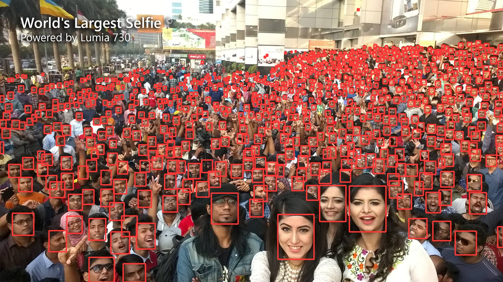

<div align="right">
  Language:
    🇺🇸
  <a title="Chinese" href="./README.zh-CN.md">🇨🇳</a>
</div>

<div align="center"><a title="" href="https://github.com/zjykzj/YOLO5Face"></a></div>

<p align="center">
  «YOLO5Face» reproduced the paper "YOLO5Face: Why Reinventing a Face Detector"
<br>
<br>
  <a href="https://github.com/RichardLitt/standard-readme"></a>
  <a href="https://conventionalcommits.org"></a>
  <a href="http://commitizen.github.io/cz-cli/"></a>
</p>

***[zjykzj/YOLO11Face](https://github.com/zjykzj/YOLO11Face) provides implementations of YOLO8Face and YOLO11Face***

ONLINE DEMO：[FACE AND LANDMARKS DETECT](https://blog.zjykzj.cn/gradio/yolo5face/)

|                                      |       ARCH        | GFLOPs |   Easy    |  Medium   |   Hard    |
|:------------------------------------:|:-----------------:|:------:|:---------:|:---------:|:---------:|
|     **zjykzj/YOLO5Face (This)**      |   yolov5s-face    |  15.2  |   94.69   |   93.00   |   84.73   |
| **deepcam-cn/yolov5-face(Official)** |   yolov5s-face    |   /    |   94.33   |   92.61   |   83.15   |
|     **zjykzj/YOLO5Face (This)**      | shufflenetv2-face |  1.5   |   90.27   |   87.39   |   73.60   |
| **deepcam-cn/yolov5-face(Official)** | shufflenetv2-face |   /    |   90.76   |   88.12   |   73.82   |
|                                      |                   |        |           |           |           |
|     **zjykzj/YOLO5Face (This)**      |   yolov5x-v7.0    |  204   | **95.79** | **94.53** | **87.63** |
|     **zjykzj/YOLO5Face (This)**      |   yolov5s-v7.0    |  15.8  |   94.84   |   93.28   |   84.67   |
|     **zjykzj/YOLO5Face (This)**      |   yolov5n-v7.0    |  4.2   |   93.25   |   91.11   |   80.33   |



## Table of Contents

- [Table of Contents](#table-of-contents)
- [News🚀🚀🚀](#news)
- [Background](#background)
- [Installation](#installation)
- [Usage](#usage)
  - [Train](#train)
  - [Eval](#eval)
  - [Predict](#predict)
- [Maintainers](#maintainers)
- [Thanks](#thanks)
- [Contributing](#contributing)
- [License](#license)

## News🚀🚀🚀

| Version                                                           | Release Date | Major Updates                                                                     |
|-------------------------------------------------------------------|--------------|-----------------------------------------------------------------------------------|
| [v1.1.1](https://github.com/zjykzj/YOLO5Face/releases/tag/v1.1.1) | 2024/08/17   | Update and add Gradio demo.                                                       |
| [v1.1.0](https://github.com/zjykzj/YOLO5Face/releases/tag/v1.1.0) | 2024/07/21   | Supports additional models including shufflenetv2-face/yolov5x-v7.0/yolov5n-v7.0. |
| [v1.0.0](https://github.com/zjykzj/YOLO5Face/releases/tag/v1.0.0) | 2024/07/14   | Adds keypoint detection, enabling face + keypoint detection.                      |
| [v0.1.0](https://github.com/zjykzj/YOLO5Face/releases/tag/v0.1.0) | 2024/06/29   | Trains a face detector based on yolov5-v7.0 and the WIDERFACE dataset.            |

## Background

[YOLO5Face](https://arxiv.org/abs/2105.12931) is a very interesting work that further abstracts the task of face detection. By directly using a universal object detection algorithm, good face detection results can be achieved. Of course, it also achieves 5-point facial keypoint regression. Based on [ultralytics/yolov5](https://github.com/ultralytics/yolov5), YOLO5Face can easily apply different models and training, such as using lightweight networks for real-time detection and using large networks for higher detection accuracy.

Note: the latest implementation of YOLO5Face in our warehouse is entirely based on [ultralytics/yolov5 v7.0](https://github.com/ultralytics/yolov5/releases/tag/v7.0).

## Installation

```shell
$ pip3 install -r requirements.txt
```

Or use docker container

```shell
$ docker run -it --runtime nvidia --gpus=all --shm-size=16g -v /etc/localtime:/etc/localtime -v $(pwd):/workdir --workdir=/workdir --name yolo5face ultralytics/yolov5:v7.0
```

## Usage

* Download WIDERFACE dataset: [Baidu Drive](https://pan.baidu.com/s/1aHdWgLq1ne_MEr9fkcS7Rg)(08p0)

### Train

```shell
# yolov5s_v7.0
$ python3 widerface_train.py --data widerface.yaml --weights "" --cfg models/yolo5face/cfgs/yolov5s_v7_0.yaml --hyp models/yolo5face/hyps/hyp.scratch-low.yaml --img 800 --epoch 300 --device 0
# yolov5s-face
$ python3 widerface_train.py --data widerface.yaml --weights "" --cfg models/yolo5face/cfgs/yolov5s_face.yaml --hyp models/yolo5face/hyps/hyp.scratch.yaml --img 800 --epoch 300 --device 0
```

### Eval

```shell
$ python widerface_detect.py --weights ./runs/exp4-yolov5s_v7_0-i800-e300.pt --source ../datasets/widerface/images/val/ --folder_pict ../datasets/widerface/wider_face_split/wider_face_val_bbx_gt.txt --conf-thres 0.001 --iou-thres 0.6 --save-txt --save-conf --device 0
...
YOLOv5s_v7_0 summary: 157 layers, 7039792 parameters, 0 gradients, 15.8 GFLOPs
...
Speed: 0.4ms pre-process, 8.8ms inference, 0.8ms NMS per image at shape (1, 3, 640, 640)
Results saved to runs/detect/exp7
0 labels saved to runs/detect/exp7/labels
$ cd widerface_evaluate/
$ python3 evaluation.py -p ../runs/detect/exp7/labels/ -g ./ground_truth/
Reading Predictions : 100%|█████████████████████████████████████████████████████████████████████████████████████████████████████████| 61/61 [00:00<00:00, 62.18it/s]
Processing easy: 100%|██████████████████████████████████████████████████████████████████████████████████████████████████████████████| 61/61 [00:20<00:00,  2.94it/s]
Processing medium: 100%|████████████████████████████████████████████████████████████████████████████████████████████████████████████| 61/61 [00:20<00:00,  2.98it/s]
Processing hard: 100%|██████████████████████████████████████████████████████████████████████████████████████████████████████████████| 61/61 [00:20<00:00,  2.97it/s]
==================== Results ====================
Easy   Val AP: 0.9483604102331251
Medium Val AP: 0.9328484206418773
Hard   Val AP: 0.8467345083774318
=================================================
```

### Predict

```shell
$ python detect_face_and_landmarks.py --weights ./runs/exp4-yolov5s_v7_0-i800-e300.pt --source assets/selfie.jpg --imgsz 2048 --conf-thres 0.25 --iou-thres 0.45 --hide-labels --hide-conf
```

## Maintainers

* zhujian - *Initial work* - [zjykzj](https://github.com/zjykzj)

## Thanks

* [zjykzj/YOLOv3](https://github.com/zjykzj/YOLOv3)
* [ultralytics/yolov5](https://github.com/ultralytics/yolov5)
* [deepcam-cn/yolov5-face](https://github.com/deepcam-cn/yolov5-face)
* [WIDER FACE: A Face Detection Benchmark](http://shuoyang1213.me/WIDERFACE/)

## Contributing

Anyone's participation is welcome! Open an [issue](https://github.com/zjykzj/YOLO5Face/issues) or submit PRs.

Small note:

* Git submission specifications should be complied
  with [Conventional Commits](https://www.conventionalcommits.org/en/v1.0.0-beta.4/)
* If versioned, please conform to the [Semantic Versioning 2.0.0](https://semver.org) specification
* If editing the README, please conform to the [standard-readme](https://github.com/RichardLitt/standard-readme)
  specification.

## License

[Apache License 2.0](LICENSE) © 2024 zjykzj