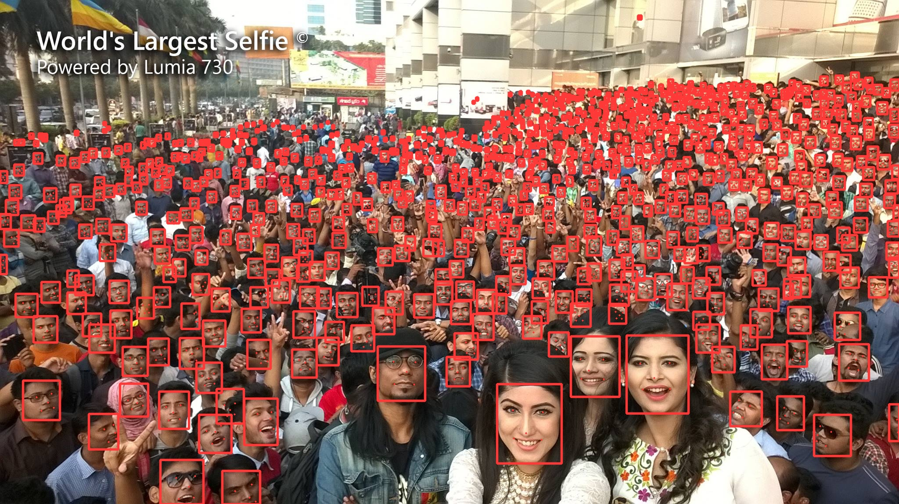

<div align="right">
  语言:
    🇨🇳
  <a title="英语" href="./README.md">🇺🇸</a>
</div>

<div align="center"><a title="" href="https://github.com/zjykzj/YOLO5Face"></a></div>

<p align="center">
  «YOLO5Face» 复现了论文 "YOLO5Face: Why Reinventing a Face Detector"
<br>
<br>
  <a href="https://github.com/RichardLitt/standard-readme"></a>
  <a href="https://conventionalcommits.org"></a>
  <a href="http://commitizen.github.io/cz-cli/"></a>
</p>

<!-- <style type="text/css">
.tg  {border-collapse:collapse;border-spacing:0;}
.tg td{border-color:black;border-style:solid;border-width:1px;font-family:Arial, sans-serif;font-size:14px;
  overflow:hidden;padding:10px 5px;word-break:normal;}
.tg th{border-color:black;border-style:solid;border-width:1px;font-family:Arial, sans-serif;font-size:14px;
  font-weight:normal;overflow:hidden;padding:10px 5px;word-break:normal;}
.tg .tg-zkss{background-color:#FFF;border-color:inherit;color:#333;text-align:center;vertical-align:top}
.tg .tg-vc3l{background-color:#FFF;border-color:inherit;color:#1F2328;text-align:center;vertical-align:top}
.tg .tg-c3ow{border-color:inherit;text-align:center;vertical-align:top}
.tg .tg-fr9f{background-color:#FFF;border-color:inherit;color:#333;font-weight:bold;text-align:center;vertical-align:top}
.tg .tg-jw1t{background-color:#FFF;border-color:inherit;color:#555;font-weight:bold;text-align:center;vertical-align:top}
.tg .tg-7btt{border-color:inherit;font-weight:bold;text-align:center;vertical-align:top}
.tg .tg-9y4h{background-color:#FFF;border-color:inherit;color:#1F2328;text-align:center;vertical-align:middle}
.tg .tg-y5w1{background-color:#FFF;border-color:inherit;color:#00E;font-weight:bold;text-align:center;vertical-align:top}
</style> -->
<table class="tg"><thead>
  <tr>
    <th class="tg-fr9f"></th>
    <th class="tg-fr9f">ARCH</th>
    <th class="tg-fr9f">GFLOPs</th>
    <th class="tg-jw1t">Easy</th>
    <th class="tg-7btt">Medium</th>
    <th class="tg-7btt">Hard</th>
  </tr></thead>
<tbody>
  <tr>
    <td class="tg-fr9f">deepcam-cn/yolov5-face(Official)</td>
    <td class="tg-zkss"><span style="background-color:#FFF">yolov5s-face</span></td>
    <td class="tg-zkss">/</td>
    <td class="tg-9y4h">94.33</td>
    <td class="tg-9y4h">92.61</td>
    <td class="tg-9y4h">83.15</td>
  </tr>
  <tr>
    <td class="tg-y5w1">zjykzj/YOLO5Face<span style="font-weight:700;font-style:normal">(This)</span></td>
    <td class="tg-zkss"><span style="background-color:#FFF">yolov5s-face</span></td>
    <td class="tg-vc3l">15.1</td>
    <td class="tg-9y4h">94.34</td>
    <td class="tg-c3ow">92.72</td>
    <td class="tg-c3ow">84.47</td>
  </tr>
  <tr>
    <td class="tg-y5w1">zjykzj/YOLO5Face<span style="font-weight:700;font-style:normal">(This)</span></td>
    <td class="tg-zkss"><span style="background-color:#FFF">yolov5s</span></td>
    <td class="tg-vc3l">15.8</td>
    <td class="tg-zkss">95.21</td>
    <td class="tg-vc3l">93.42</td>
    <td class="tg-vc3l">84.03</td>
  </tr>
</tbody></table>

## 内容列表

- [内容列表](#内容列表)
- [最近新闻](#最近新闻)
- [背景](#背景)
- [安装](#安装)
- [用法](#用法)
  - [数据](#数据)
  - [训练](#训练)
  - [评估](#评估)
  - [预测](#预测)
- [主要维护人员](#主要维护人员)
- [致谢](#致谢)
- [参与贡献方式](#参与贡献方式)
- [许可证](#许可证)

## 最近新闻

* ***[2024/06/29][v0.1.0](https://github.com/zjykzj/YOLO5Face/releases/tag/v0.1.0)。基于yolov5-v7.0和WIDERFACE数据集训练人脸检测器。***

## 背景

[YOLO5Face](https://arxiv.org/abs/2105.12931)是一个很有趣的工作，它进一步抽象了人脸检测任务，直接采用通用目标检测算法就可以实现很好的人脸检测效果。当然它还实现了5点人脸关键点回归。 基于[ultralytics/yolov5](https://github.com/ultralytics/yolov5)目标检测框架，YOLO5Face可以很方便的应用不同的模型和训练，比如采用轻量网络来实现实时检测，采用大网络来实现更高的检测精度。

注意：当前本仓库最新的实现完全基于[ultralytics/yolov5 v7.0](https://github.com/ultralytics/yolov5/releases/tag/v7.0)

## 安装

```shell
pip3 install -r requirements.txt
```

或者使用Docker Container

```shell
docker run -it --runtime nvidia --gpus=all --shm-size=16g -v /etc/localtime:/etc/localtime -v $(pwd):/workdir --workdir=/workdir --name yolov2 ultralytics/yolov5:latest
```

## 用法

### 数据

在[官网](http://shuoyang1213.me/WIDERFACE/)下载WIDERFACE数据集，然后转换数据集格式。

```shell
python3 widerface2yolo.py ../datasets/widerface/WIDER_train/images ../datasets/widerface/wider_face_split/wider_face_train_bbx_gt.txt ../datasets/widerface/
python3 widerface2yolo.py ../datasets/widerface/WIDER_val/images ../datasets/widerface/wider_face_split/wider_face_val_bbx_gt.txt ../datasets/widerface/
```

### 训练

```shell
# YOLOv5s
python3 train.py --data widerface.yaml --weights yolov5s.pt --cfg yolov5s.yaml --imgsz 800 --epoch 250 --device 0
# YOLOv5s-face
python3 train.py --data widerface.yaml --weights '' --cfg models/yolo5face/cfgs/yolov5s_face.yaml --hyp models/yolo5face/hyp.scratch.yaml --img 800 --epoch 250 --device 0
```

### 评估

```shell
# python widerface_detect.py --weights ./runs/train/exp4-yolov5s-e250-img800.pt --source ../datasets/widerface/images/val/ --folder_pict ../datasets/widerface/wider_face_split/wider_face_val_bbx_gt.txt --conf-thres 0.001 --iou-thres 0.6 --save-txt --save-conf --device 0
...
YOLOv5s summary: 157 layers, 7012822 parameters, 0 gradients, 15.8 GFLOPs
...
Speed: 0.3ms pre-process, 9.0ms inference, 0.9ms NMS per image at shape (1, 3, 640, 640)
Results saved to runs/detect/exp5
0 labels saved to runs/detect/exp5/labels
# cd widerface_evaluate/
# python3 evaluation.py -p ../runs/detect/exp5/labels/ -g ./ground_truth/
Reading Predictions : 100%|█████████████████████████████████████████████████████████████████████████████████████████████████████████| 61/61 [00:00<00:00, 94.45it/s]
Processing easy: 100%|██████████████████████████████████████████████████████████████████████████████████████████████████████████████| 61/61 [00:19<00:00,  3.13it/s]
Processing medium: 100%|████████████████████████████████████████████████████████████████████████████████████████████████████████████| 61/61 [00:19<00:00,  3.12it/s]
Processing hard: 100%|██████████████████████████████████████████████████████████████████████████████████████████████████████████████| 61/61 [00:19<00:00,  3.13it/s]
==================== Results ====================
Easy   Val AP: 0.9520941964576021
Medium Val AP: 0.9341770033021547
Hard   Val AP: 0.8403303849682994
=================================================
```

### 预测

```shell
python detect.py --weights ./runs/exp4-yolov5s-e250-img800.pt --source assets/selfie.jpg --imgsz 2048 --conf-thres 0.25 --iou-thres 0.45 --max-det 3000 --hide-labels --hide-conf
```



## 主要维护人员

* zhujian - *Initial work* - [zjykzj](https://github.com/zjykzj)

## 致谢

* [deepcam-cn/yolov5-face](https://github.com/deepcam-cn/yolov5-face)
* [ultralytics/yolov5](https://github.com/ultralytics/yolov5)
* [zjykzj/YOLOv3](https://github.com/zjykzj/YOLOv3)

## 参与贡献方式

欢迎任何人的参与！打开[issue](https://github.com/zjykzj/YOLO5Face/issues)或提交合并请求。

注意:

* `GIT`提交，请遵守[Conventional Commits](https://www.conventionalcommits.org/en/v1.0.0-beta.4/)规范
* 语义版本化，请遵守[Semantic Versioning 2.0.0](https://semver.org)规范
* `README`编写，请遵守[standard-readme](https://github.com/RichardLitt/standard-readme)规范

## 许可证

[Apache License 2.0](LICENSE) © 2024 zjykzj